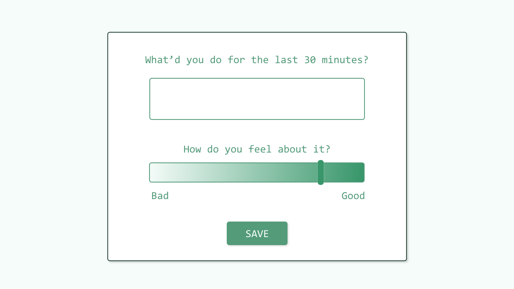
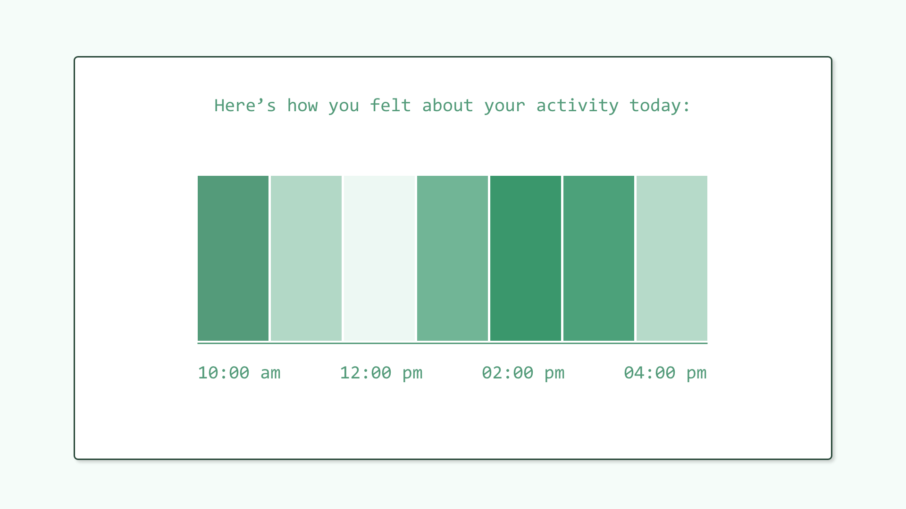

# Activity Tracker (In Progress)
A simple activity tracker to log what you did and how you felt about it.

---
## Stack
This project is built using:
- Node.js
- Express.js
- MongoDB
- Mongoose
- React.js
- SCSS

---
## UI Wireframes | Created using Adobe Xd
### Check In
Every 30 minutes, this lil’ tracker checks in.

### Report
The tracker displays your feelings about your day as a gradient of green. And on hover...

### Report on hover

...you can see exactly what you were doing to make you feel that shade of green.
