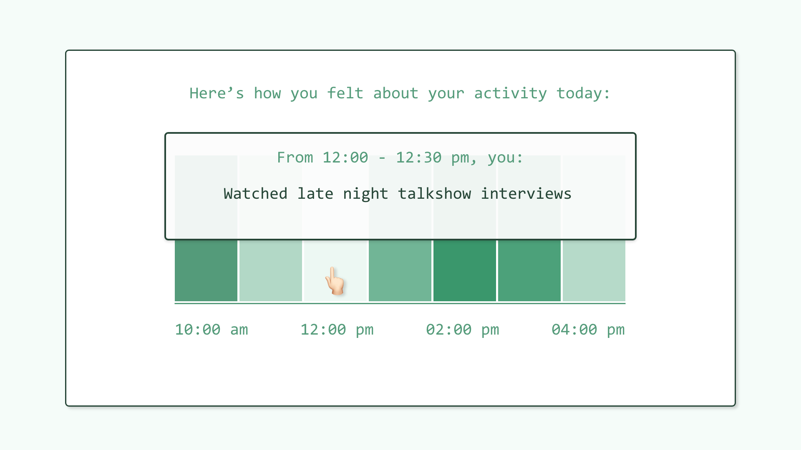

# Activity Tracker
A simple activity tracker to keep track of what you did and how you felt about it.

## Check In
Every 30 minutes, this lil’ tracker will check in, ask what you’ve been up to and how you feel about your activity in the last 30 minutes.

## Report
The tracker will display your feelings about your day. And on hover...

## Report on hover

...you can see exactly what you were doing to make you feel that shade of green.
